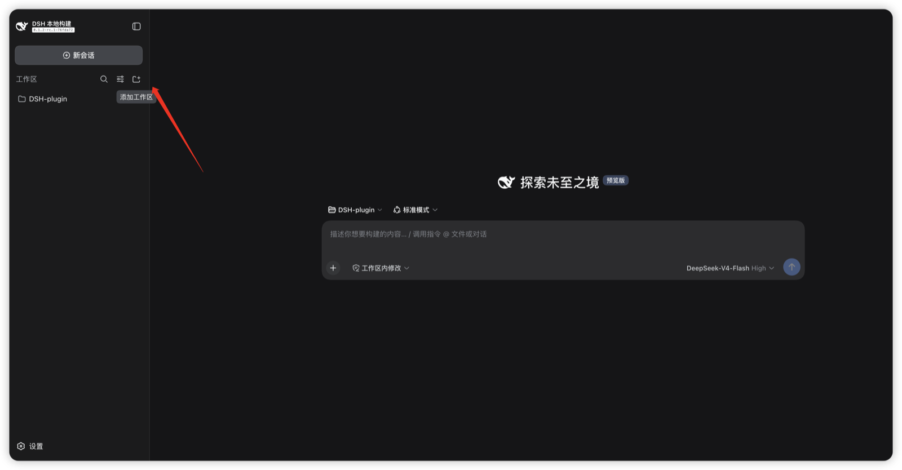
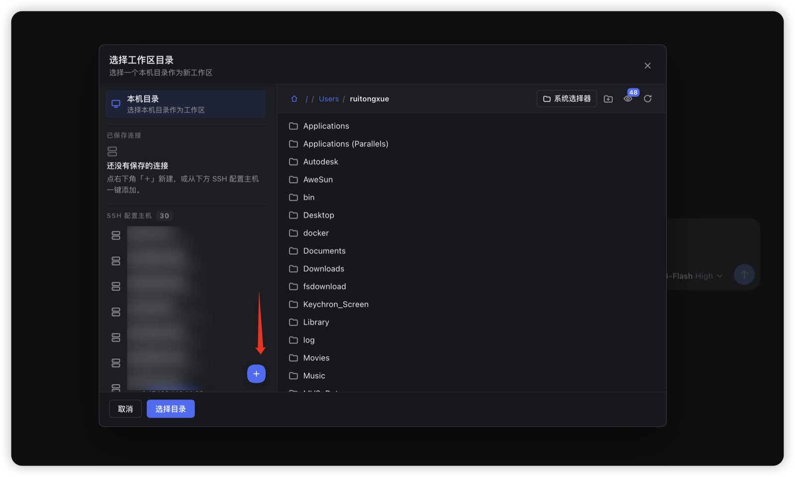
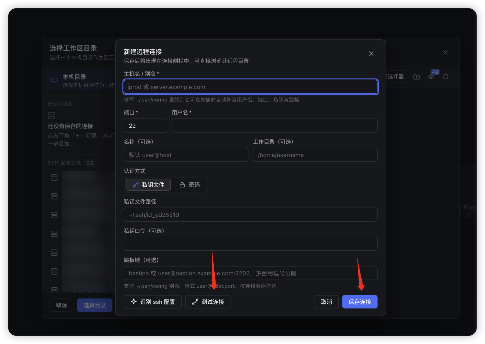
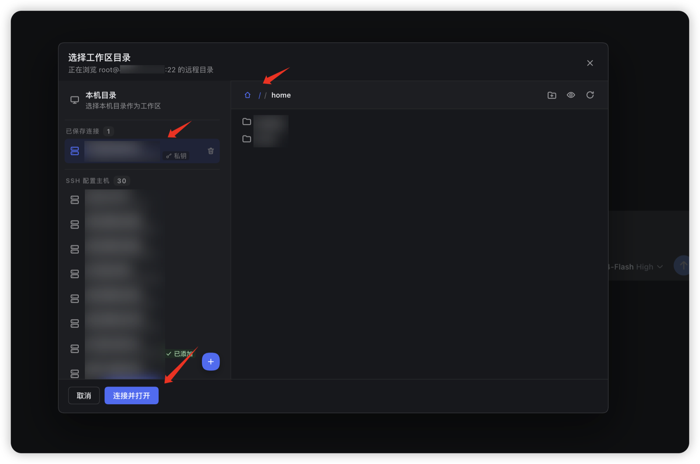
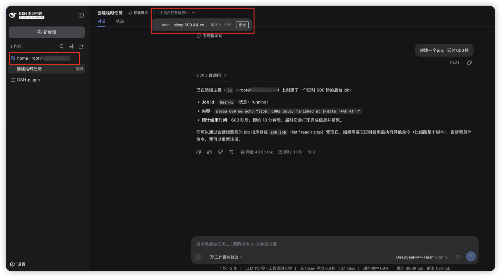

# dsh-remote-ssh

> [English](../README.md) | 中文

> Move the workspace's file IO and command execution onto an SSH target — while sessions, the web GUI, and `$DSH_HOME` stay on this machine. A DSH plugin set for **remote development over SSH**.

把 DSH 的**工作区放到远端机器上**：本机保留会话、浏览器界面与配置，文件的读写、命令的执行都发生在你指定的 SSH 主机上。侧边栏里管理连接、浏览远端目录，会话按路由在**多台远端机器之间切换**，互不干扰。

本文件面向使用者；设计取舍、契约与审计细节见 [`DESIGN.md`](../DESIGN.md) 与 [`specs/`](../specs/)。配套的 **harness fork 补丁**（同名远端工作区的路由后缀标题）见 [Issue #1](https://github.com/aijunjiang/dsh-remote-ssh/issues/1) 与 [`harness-patches/`](../harness-patches/README.md)。

---

## 它能做什么

| 能力 | 说明 |
|---|---|
| **SSH 连接管理** | web GUI 侧边栏添加/测试/删除连接：密码、密钥、SSH agent、ProxyJump 跳板 |
| **远端目录浏览** | GUI 内浏览远端目录树，在任意目录建立工作区（不必手打 ssh） |
| **会话级路由** | 每个会话的工作目录决定“这台会话跑在哪台机器”：`ssh://<id>/<路径>` 或本地占位目录两种拼写等价；多台远端可同时并行 |
| **远端执行/文件**（完整模式） | `ctx.fs` / `ctx.subprocess` 指向远端：命令、git、测试、构建、读写在远端发生 |
| **Agent 引导**（内置） | 路由会话的运行时上下文自动声明“你在哪台机器”，附使用指南、`ssh_exec` / `ssh_route_status` 工具与 `DSH_SSH_*` 环境变量，防止把远端当本地、把空占位当空项目 |
| **凭据驻留本机** | 密码与身份密钥只存在本机 DSH home；远端只看到你授权的账号 |

---

## 效果演示：从本机 GUI 到远端路由会话（图文）

五步走完一条链路：添加远程连接 → 浏览远端 → 把远端目录收为工作区 → 开一个真正跑在远端机器上的会话。

**1 · 从这里进入**：每个远端工作区都从侧边栏「工作区」面板的「添加工作区」开始。



**2 · 选本机目录，或新建一条远程连接**：目录选择弹窗默认浏览本机；左下「＋」打开「新建远程连接」表单。



**3 · 新建远程连接**：填写主机名/别名、端口、用户名，私钥或密码认证，可选 ProxyJump 跳板链；`~/.ssh/config` 别名失焦自动补全，保存前可「测试连接」。



**4 · 浏览远端并收为工作区**：保存的连接直接进入远端目录树，选择将成为工作区的目录并「连接并打开」。



**5 · 路由会话：命令真的跑在远端**：工作区标题带上主机后缀（`home · root@…`），在该工作区开的会话执行在**远端机器**上——图中 agent 用 `ssh_job` 建了一个 600 秒的后台任务，会话顶部任务条实时显示「1 个后台任务运行中」并带「停止」。



> **工作区标题的主机后缀**与会话内的 **job 指示 /「停止」**来自 harness fork 补丁——见 [`harness-patches/README.md`](../harness-patches/README.md) 与 [Issue #1](https://github.com/aijunjiang/dsh-remote-ssh/issues/1)。以上截图拍摄于已打补丁的构建。

---

## 安装

前置：

- 本机：DSH（deepseek-harness）与 Node ≥ 22
- 远端：可 SSH 登录的账号，主机上有 `python3` 与 `bash`（helper 依赖）

### 方式 A：官方 `dsh plugin add`（推荐，装完启动零参数）

仓库根就是官方包（`dsh.bundle.patch` 声明了 GUI 用户层），安装后每次启动自动生效：

```bash
# 本地路径（开发中）或 GitHub：
dsh plugin --profile web add <本仓库路径>
# 正式发布形态：
dsh plugin --profile web add github:aijunjiang/dsh-remote-ssh

# 然后照常启动，不加任何参数：
pnpm dsh web
```

> 该命令 pnpm 安装根包（内部依赖走 DSH 基线 peer，npm 只拉 ssh2），并把声明了 `dsh.bundle` 的包自动加入 profile 的 bundles 层。卸载：`dsh plugin --profile web remove dsh-remote-ssh`。

### 方式 B：本地开发安装脚本

```bash
git clone https://github.com/aijunjiang/dsh-remote-ssh && cd dsh-remote-ssh
node scripts/install.mjs                 # 链接 4 个包 + 注册 GUI 层（幂等）
# 选项：--home <dsh home> | --profile <name>（默认 web）| --remove（卸载）
pnpm dsh web                             # 零参数
```

> 两种方式装出的都是同一层：SSH GUI 用户层 + agent 体验。方式 B 额外保留 4 个包名便于 `--patch` 使用完整模式。

启动形态：

```bash
# A.（默认注册的这层）SSH GUI 用户层：连接管理 + 远端目录浏览 +
#    agent 路由身份/指南 + ssh_exec/ssh_route_status。本机 fs/subprocess 保持不变。
pnpm dsh web

# B. 完整远端工作区：本机文件与命令整体切到远端（另起实例跑，勿装在常用实例上）
export DSH_REMOTE_HOST=your-host
export DSH_REMOTE_USER=your-user
export DSH_REMOTE_PASSWORD=your-password      # 仅首次；随后自动改用密钥
export DSH_REMOTE_CWD=/home/you/workspace
pnpm dsh web --patch <repo>/cordis.patch.yml
```

---

## 快速开始（GUI）

1. **添加一条连接**：侧边栏「工作区」→「添加工作区」→ 左下「＋」新建远程连接，填好主机/账号/认证（可选跳板链），先「测试连接」再「保存连接」（截图 1–3）。
2. **把远端目录收为工作区**：进入刚保存的连接，浏览远端目录树，在目标目录上把它选为工作区并「连接并打开」（截图 4）。
3. **开一个路由会话**：用该工作区新建会话，会话就跑在**远端机器**上（截图 5）。工作区标题的主机后缀与会话内 job 指示/「停止」依赖 harness fork 补丁（[`harness-patches/README.md`](../harness-patches/README.md)、[Issue #1](https://github.com/aijunjiang/dsh-remote-ssh/issues/1)）——上面的截图来自已打补丁的构建。

开出来的就是**路由会话**：运行时上下文会显示类似

> This session's working directory is on SSH route `c1` (dev@192.168.0.101:22); its remote absolute path is /home/dev/projects/project-alpha.

并附一段使用指南（何时用 `ssh_exec`、镜像目录不可信、路由断了先查 `ssh_route_status`、输出上限等）。直接说“看下这台设备的硬件”即可——agent 会用内置 `ssh_exec` 在**远端**执行，而不是本机。

### 同名目录的显示规则

同名目录跨设备/路径不会混淆：每个远端工作区按 `路由 + 远端绝对路径` 唯一，工作区/会话标题自动加人类可读的主机后缀（来自连接 label，缺省为 `user@host`）：

```
project-alpha · dev@192.168.0.101      # 远程服务器 192.168.0.101 上
project-alpha · dev@192.168.0.102      # 另一台远程服务器上
```

给连接起有意义的 label（如 `dev-server`）时后缀用 label。规则同样适用于 agent：runtime context 会直接声明路由与主机，`ssh_route_status` 可随时复核。

### Agent 侧已内置的能力

- **`ssh_exec`**：把整段脚本作为一条 `command` 在远端 bash 执行。走插件自带的 ssh2/helper 通道——**不要手搓本机 ssh.exe**（Windows 受限沙箱下无法 spawn，且纯属绕路）。locale 固定 `C`；输出上限 256 KiB/流，截断会标记；每条结果带**结束哨兵**校验：`exit 0 + 空输出` 只有标了 sentinel-verified 才算真空，疑似丢输出自动重试一次并显式报错。
- **`ssh_route_status`**：查看当前会话的路由、目标主机、已知连接清单与路由清单文件；`checkLive: true` 可做真实连通性探测。
- **环境变量**：路由会话的 shell 自带 `DSH_SSH_ROUTE_ID / HOST / USER / PORT / REMOTE_CWD / ENDPOINT`。
- **路由清单文件**：`<dsh home>/dsh-ssh-routes.json`——明文、无密钥，离线时也能查到“c1 是哪台机”。
- **读写语义自适应**：完整模式下你的 read/write/glob/grep 直接打在远端；仅 GUI 层时它们仍是本机，指南会明说“远端文件用 `ssh_exec` 里的 `cat` / `sed -n` / heredoc，绝不写本地占位目录”。

---

## 完整模式（把本地世界整体切到远端）

`cordis.patch.yml`（仓库根）做的是**一次性切换**而非叠加：

- 关闭本地 `subprocess`、`fs-sandbox`、`sandbox`、两套沙箱 shell、本地目录选择器与权限预设；
- 挂上远端 `fs-ssh`、`subprocess-ssh`（含远端 `shell`）与会话路由所需 GUI 层；
- `sandbox-policy.workspaceRoot` 指向 `DSH_REMOTE_CWD`。

环境变量：

| 变量 | 作用 |
|---|---|
| `DSH_REMOTE_HOST` | 目标主机（必填） |
| `DSH_REMOTE_USER` | 远端账号（必填） |
| `DSH_REMOTE_PASSWORD` | 仅首次连接；随后自动置备密钥 |
| `DSH_REMOTE_PORT` | 默认 22 |
| `DSH_REMOTE_CWD` | 远端工作目录（默认 `/root/workspace`） |
| `DSH_REMOTE_RIPGREP` | 可选：远端 rg 绝对路径（不设则自动探测） |

> 同一个目录只有一个出处：`cwd` 与 `sandbox-policy.workspaceRoot` 都从 `DSH_REMOTE_CWD` 派生，保证“文件与命令在同一个世界”。

---

## 安全模型（务必阅读）

- **远端只有账号权限做围栏。** 完整模式下本机沙箱行被关闭：把命令与文件交给哪台机器，就是让 agent 以该账号的权限在那台机器上操作。请用**专用账号 / 最小权限 / 定期轮换密钥**，或经 ProxyJump 限定可达范围。
- 连接密码与密钥只存本机 `<dsh home>/dsh-ssh-connections.json` 与身份目录；路由清单不含任何密钥。
- 仅 GUI 模式（A 启动）不动本机文件/命令世界，风险面小得多——先用它熟悉，再上完整模式。

---

## 限制（诚实清单）

- **仅 GUI 模式不切 fs/subprocess**：文件/命令仍是本机，`dsh-ssh-routes/...` 只是占位目录（agent 指南会提示）。
- **PTY 未实现**：`spawnTerminal` 在远端连接上不可用（helper PTY 子面未完成），终端类功能暂不可用；普通执行不受影响。
- `ssh_exec` 单次调用串行执行；一次调用内可跑多条命令。
- 远端 `read` 无行号标注；大文件请用 `sed -n` 开窗。
- 执行远端命令的目标需要 Python helper（首次调用自动部署到该账号 home 下）。

---

## 目录结构（概览）

```
package.json               # 官方根包：dsh.bundle.patch -> bundle.gui.patch.yml
bundle.gui.patch.yml       # 官方 GUI 用户层（dsh plugin add 自动应用）
src/index.ts               # 官方根包入口（复用 packages/ssh-gui 插件面）
lib/client.js              # 官方根包 client bundle（id dsh-remote-ssh）
cordis.patch.yml           # 完整模式组合（one-world 切换 + 远端行）
packages/
  ssh/                      # 连接 owner：认证阶梯、密钥置备、helper 通道与协议
  fs-ssh/                   # ctx.fs → 远端文件系统（单次往返列出、流式限长读、CAS 写）
  subprocess-ssh/           # ctx.subprocess → 远端进程（真实 pid/pgid、树级终止、spill 落远端）
  remote-argv/              # 远端 rg/grep argv 翻译
  ssh-gui/                  # GUI：注册表 /dsh-ssh RPC / 侧边栏 / React bundle + agent 体验
scripts/
  install.mjs               # 本地开发安装（链接 + profile 自动注册；--remove 卸载）
  build-gui-client.mjs      # 重建 client bundle（dev id dsh-ssh-gui / 官方 id dsh-remote-ssh）
  test.mjs                  # 全部本地测试：node scripts/test.mjs
specs/ DESIGN.md            # 契约、审计、设计依据（技术细节入口）
```

开发、测试、bundle 构建与设计依据见 [`DESIGN.md`](../DESIGN.md)；与上游 fork 的差异见 [`specs/upstream-dsh-ssh-audit.md`](../specs/upstream-dsh-ssh-audit.md)。连接侧边栏与目录浏览器为 `UynajGI/dsh-ssh` (MIT) 的 fork。同名目录标签的 harness 补丁见 [`harness-patches/`](../harness-patches/README.md)（[Issue #1](https://github.com/aijunjiang/dsh-remote-ssh/issues/1)）。

---

## License

[MIT](../LICENSE)
